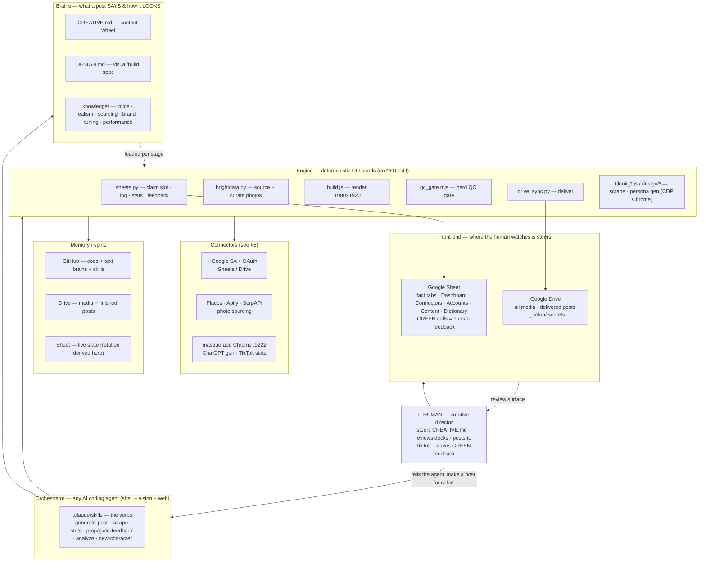
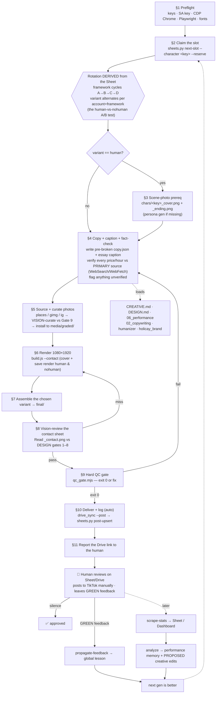

# Project Ana 2.0

**A TikTok carousel factory with a human in the director's chair and an AI agent in the workshop.**
You — the human — own the *creative direction*: what the brand says, which angles win, what ships, and
every actual post to TikTok. The agent owns the *production line*: it claims the next slot, writes the
copy, fact-checks it, sources real photos, renders a pixel-locked **1080×1920** deck, QCs it, and delivers
it to your review surface. Nothing publishes without you, and nothing about the brand's voice changes
unless you change it.

The whole system is built around one inversion of the usual "AI content" pitch: **the machine is not
creative — you are.** It is a tireless, consistent, fact-checking production crew that reproduces *your*
four blueprints perfectly every time. Creativity, taste, and brand ownership stay human by design.

Drive it with **any** capable AI coding agent (Claude Code, Codex, Cursor, …) or by hand — the engine is
plain `bash` / `python3` / `node`, and the workflow is markdown the agent reads and executes.

---

## 1 · The governing principle: the human directs, the agent executes

Everything below hangs off this split. It is worth stating before the architecture, because the
architecture only makes sense once you see which decisions are deliberately *not* the agent's to make.

| The **human** directs (creative + judgment) | The **agent** executes (production + consistency) |
|---|---|
| **What every post says** — the four framework blueprints, hooks, slide maps, the Holicay plug copy, voice — all live in [`CREATIVE.md`](CREATIVE.md), your "content wheel." Edit it, or tell the agent to. | Writes each post's copy *within* those blueprints — only the words and photos change, never the structure. |
| **How every post looks** — canvas, type system, plug treatment, QC gates — live in [`DESIGN.md`](DESIGN.md). | Renders exactly to that spec with a locked renderer it is forbidden to edit. |
| **What actually ships** — you review every deck on Drive/Sheet before it goes live. **Silence = approval.** | Delivers to your review surface automatically; never publishes. |
| **Every TikTok post** — posting is *always* manual. | Hands you a finished deck + caption; stops there. |
| **The feedback** — the GREEN cells on the Sheet are your channel; each becomes a *global* lesson. | Reads GREEN cells, propagates each into the one governing doc, clears the cell, logs it. |
| **The strategy calls** — the agent's `analyze` pass *proposes* creative changes; you approve or reject. | Mines the data, writes the performance memory, but never silently rewrites the creative spec. |

Read that split as the product spec. The agent is near-autonomous on *production* precisely so your
attention is reserved for *direction*.

---

## 2 · What it produces

Three parallel TikTok accounts, one per **character** (a digital-influencer persona with a locked visual
identity). Each account quietly funnels viewers toward **Holicay**, a travel itinerary-planner app
(holicay.com).

| Character | Prefix | Country | TikTok | Next id | Scene photos |
|---|---|---|---|---|---|
| **Ana** | `tt-` | Vietnam | @solo.with.ana | `tt-20` | pending¹ |
| **Chloe** | `ttc-` | Japan | @chloe.belletravel | `ttc-11` | ready |
| **Hannah** | `tth-` | USA | *(handle pending)* | `tth-05` | pending¹ |

¹ *A character needs her scene photos (`chars/<key>_cover.png` + `chars/<key>_ending.png`) before her first
**human**-variant post. Chloe has hers; Ana and Hannah need theirs generated (the `new-character` skill's
final step) — their **no-human** posts are unblocked in the meantime.*

Every post is one of **four locked blueprints**, and only the copy + sourced photos change from post to post:

- **A — Fear of Mistakes** · the mistakes tourists make + what to do instead (❌ / ✅ split slides)
- **B — Hot Takes** · overrated vs. underrated, honest rankings
- **C — Full-Trip Dump** · the whole itinerary, "comment `{COUNTRY}` and I'll send it" (a comment → DM magnet)
- **D — Plan & Prep** · a first-timer's numbered planning guide

Numbering continues each account's 1.0 history. The original **Project Ana** stays untouched as a read-only
archive — 2.0 is a fresh repo + fresh cloud and never writes back to it.

---

## 3 · The three homes (where state lives)

Three shared resources, all owned by `creators@holicay.com`:

- **GitHub** — code, text brains, skills. No secrets, no media. https://github.com/Davenkoh/Project-Ana-2
- **Google Sheet** — "Project Ana 2.0": a fact tab per character + **Dashboard · Connectors · Accounts ·
  Content · Dictionary**. This is the human front-end; **GREEN cells are your feedback channel.**
  https://docs.google.com/spreadsheets/d/1Wskn2YPWwu3cEBJVTwyYpgM7XXVjJwODLjZVqLgAqWo/edit
- **Google Drive** — "Project Ana 2.0": all media + delivered posts + `_setup/` secrets, in
  `creators@holicay.com` My Drive. Find the folder link with
  `python3 engine/drive/drive_sync.py --list-shared`.

`state.json` is the small local **registry** (each character = name + id_prefix + country + @handle) plus
the Sheet/Drive pointers. The rotation slot + next number are **derived from the Sheet, never stored.**
The rule that keeps it clean: **git carries code + text; Drive carries media + secrets; the Sheet carries
live state.**

---

## 4 · System architecture

Four repo layers, a human at the top, and a cloud spine at the bottom. Think
**director → front-end → brain + hands → connectors → memory.**



**The four repo layers, and the rule that keeps each honest:**

- **Brains** ([`CREATIVE.md`](CREATIVE.md), [`DESIGN.md`](DESIGN.md), [`knowledge/`](knowledge/)) — *text
  you own.* Strategy, voice, realism, brand. The spine is `CREATIVE.md` (what a post says) + `DESIGN.md`
  (how it looks). One lesson lives in exactly one doc (DRY).
- **Hands** ([`engine/`](engine/)) — *finished, verified, deterministic CLI.* Plain `python3` / `node`,
  driven by per-post **data** (`copy.json`, slug plans), never by new bespoke scripts. **You never edit the
  engine** — you add a backend or a template, not a file.
- **Verbs** ([`.claude/skills/`](.claude/skills/)) — plain-markdown skills any agent reads. Each one
  *sequences* [`WORKFLOW.md`](WORKFLOW.md); it never forks the commands.
- **State** (`state.json` + the Sheet) — a tiny local registry plus cloud pointers. The rotation is never
  stored; it is *derived live from the Sheet* each time.

**The front door is [`AGENTS.md`](AGENTS.md):** a pure index that resolves *capability → the one canonical
home.* It is how any orchestrator bootstraps — nothing here is Claude-specific.

**The masquerade Chrome** (`~/.masquerade_chrome`, CDP on `:9222`) earns a callout: two connectors —
ChatGPT image generation and TikTok stats — have *no API.* They run through a real, logged-in Chrome the
engine drives over the Chrome DevTools Protocol. That is why "log in once" is a setup step, and why "quit
Chrome after CDP work" is a guardrail.

---

## 5 · Connectors

Thirteen external services, catalogued in [`CONNECTORS.md`](CONNECTORS.md) (which mirrors the Sheet's
**Connectors** tab — its Notes column is a GREEN feedback channel). Grouped by the job they do:

**Google — the cloud backbone (two *separate* GCP projects — the #1 trap)**

| Connector | Role | Auth | Note |
|---|---|---|---|
| **Google service account** | Sheets read/write + Drive **reads** | `holicay-402208-*.json` at repo root | GCP project **holicay-402208**; share the Sheet/Drive with its email |
| **Google OAuth Drive client** | Drive **uploads** as `creators@holicay.com` | `client_secret*.json` → per-user `drive_token.json` | GCP project **masquerade-2** — a *different* project; legacy but working |

> A new machine needs **both** Google credentials plus a **per-person `drive_token.json`** it mints itself.
> They are not interchangeable.

**Photo sourcing**

| Connector | Role | Status |
|---|---|---|
| **Google Places** | user-review photos (the **prioritized UGC source**) + route-map shots | ACTIVE — primary |
| **Apify** | Instagram UGC (`brightdata.py ig`) | ACTIVE — the working IG backend (free plan, $5/mo credit) |
| **SerpAPI** | Google Images (`gimg`) | ACTIVE (paid per-search) |
| **Bright Data** | Google-reviews backend | PARTIAL — reviews flaky, IG **KYC-blocked** (Apify covers IG) |
| **iTunes Search API** | real app icons for Framework D | ACTIVE — keyless |
| **Pexels · Unsplash · scrape.do** | legacy photo / proxy | optional |

**Browser logins (no API key — live in the masquerade Chrome)**

| Connector | Role | Fix when it breaks |
|---|---|---|
| **ChatGPT** | character / cover image generation | re-login in the masquerade Chrome |
| **TikTok** | stats scraping (views are **login-gated**) | `tiktok_login.js --open` · per-account logins live on the Sheet's **Accounts** tab |

**Code home:** **GitHub** (`Davenkoh/Project-Ana-2`), via the `gh` CLI.

The seven sourcing API keys sit in a gitignored `keys.env` at the repo root, distributed privately via Drive
`_setup/`. If that folder is ever over-shared, the fix is to rotate the SA key + all seven API keys and
re-publish. Full billing, rotation, and troubleshooting: [`CONNECTORS.md`](CONNECTORS.md).

---

## 6 · How it works — the production loop

One continuous loop turns **a country + a rotation slot** into **a delivered, logged carousel.** The
`generate-post` skill sequences it; [`WORKFLOW.md`](WORKFLOW.md) §1–§11 holds the exact command for each
stage. Every stage is independently re-runnable, so a regen re-enters mid-flow.



### The pieces that make it work

**The rotation engine (derived, never stored).** When you claim a slot, `next-slot` reads the character's
fact tab on the Sheet and computes three things live:

- **framework** cycles **A → B → C → D** by the count of that account's framework-bearing rows;
- **variant** alternates **per (account, framework)** off the framework default (**all four default
  `human`** — cover + ending carry the character) — even prior count → the default, odd → the other;
- **copy_iteration** counts prior (framework, country) packs → drives the §4 freshness rule.

`--reserve` drops an atomic `(building)` stub so a teammate claiming a slot a moment later rotates *past*
yours. An abandoned build leaves that stub — `post-delete` frees the number and the slot again.

**The human-vs-no-human experiment.** This is the built-in A/B test and the headline of every learning pass.
Each account posts each framework **both ways** over time: a **human** cover/ending (the character in scene)
and a **no-human** one (pure scenic, identical text). Because the variant alternates deterministically,
`analyze` can read which actually wins on views/saves — and tell you.

**Copy is written, then *verified*.** The agent drafts from pretrained knowledge (fast, but it treats every
price/hour/venue status as unverified), then fact-checks each number against the **primary source** — the
venue's or operator's own site via WebSearch/WebFetch, never a listicle. Opinions ("overrated") are not
fetched but must each be *anchored to a verified fact.* Anything unverifiable is surfaced to you in
`flags.md`, never buried in the copy. Lines arrive **pre-broken** — the renderer never re-wraps, so phrasing
is a copy decision, not a layout accident.

**Photos must read as a real visitor's phone shot (Gate 9).** Body photos are sourced UGC (Google Places
user photos prioritized, Instagram via Apify, Google Images as a sensible fallback) and then
**vision-curated** by the agent: reject drone/aerial, tripod long-exposure, HDR-postcard, editorial/staged.
The scenic cover, ending, and the A/B/D plug background are the only postcard-allowed exemptions. Picks are
*installed* to `media/graded/<slug>.jpg` with attribution; the scratch library is pruned after.

**The Holicay plug is always slide 4, always first person.** It is a testimonial ("holicay.com is my game
changer, when i dump in…"), never an imperative pitch — the ❌ is her old mess, the ✅ is what she does now.
The copy is **verbatim** from `CREATIVE.md`; the deliberate lowercase and misspellings ("alot", "revisted",
"incase") *are* the voice and are never cleaned up.

**Two QC gates — vision, then mechanical.** §8 is the human-like eyeball check: the agent `Read`s the
labeled contact-sheet montage against DESIGN gates 1–8 (centered text, per-line hugging boxes, legible
dividers, real fonts not tofu, correct plug treatment). §9 is the hard gate `qc_gate.mjs`: copy.json parses
and matches the framework, `final/` names/count/contiguity, every PNG exactly 1080×1920, caption non-empty
and **dash-free**, `flags.md` present, every slug resolves with a manifest row. **A deck ships only at exit
0**, and a failure means the deck is wrong, not the gate.

**Delivery is the review surface — not publishing.** On green, delivery + logging **auto-run**: `drive_sync`
uploads `final/*.png` + caption + copy.json + flags + sources and prints the Drive link; `post-upsert` fills
the Sheet row (upserting the `(building)` stub in place). This is *not* auto-posting — the Drive folder and
Sheet row are exactly where you review, and **you** still post to TikTok.

### The learning loop (how each post makes the next one better)

- **`scrape-stats`** harvests the live TikTok posts back into the Sheet/Dashboard (views are login-gated —
  hydrated only when the masquerade Chrome is logged in).
- **`propagate-feedback`** turns each GREEN cell into a *global* lesson: classify → edit the **one**
  governing doc that controls all future posts → log it in `propagation-log.md` → clear the cell. A one-off
  fix is a regen, not a fake lesson.
- **`analyze`** is the periodic, read-only learning pass: it joins stats to frameworks/variants/countries/
  angles, rewrites `knowledge/tuning/06_performance.md` (evidence = post IDs), and **proposes** any
  `CREATIVE.md` / `DESIGN.md` edits for your sign-off. The human-vs-no-human verdict lives here.

---

## 7 · How to pilot it

### First time on a machine
Follow [`SETUP.md`](SETUP.md): clone → `bash setup.sh` (deps + pull media) → drop the 3 secret files from
Drive `_setup/` into the repo root → log into ChatGPT + TikTok once in the masquerade Chrome →
`drive_auth.py` to mint your `drive_token.json` → add the Claude Code hooks (media auto-sync + Chrome
cleanup).

### The everyday drive
You mostly talk to the agent in plain language and let the skills run. The five verbs:

| You say… | Skill | What happens |
|---|---|---|
| "generate a post for chloe" (or `all`) | **[generate-post](.claude/skills/generate-post/SKILL.md)** | runs WORKFLOW §1→§11, takes the vision gates itself, delivers for review |
| "refresh the stats" | **[scrape-stats](.claude/skills/scrape-stats/SKILL.md)** | pulls live TikTok numbers into the Sheet |
| "process the feedback" | **[propagate-feedback](.claude/skills/propagate-feedback/SKILL.md)** | turns your GREEN cells into global lessons |
| "what's working?" | **[analyze](.claude/skills/analyze/SKILL.md)** | mines the data, proposes creative edits |
| "create a new character, call it Priya, India content" | **[new-character](.claude/skills/new-character/SKILL.md)** | registry + locked identity + Sheet tab + scene photos |

The three commands worth knowing by hand:

```bash
bash engine/qc/preflight.sh                                   # 1. confirm the environment is green
python3 engine/sheets/sheets.py next-slot --character chloe   # 2. peek at the next slot (framework + variant)
# 3. tell your agent: "generate a post for chloe"
```

### Your touchpoints as director
1. **Steer the content** — edit [`CREATIVE.md`](CREATIVE.md) (or tell the agent: "make Framework A's hook
   punchier," "stop using cherry blossoms for Japan"). It wins any conflict on what a post says.
2. **Review each deck** on Drive/Sheet. Silence = approval; a comment = a regen from the affected stage.
3. **Post to TikTok yourself** — always manual.
4. **Leave GREEN feedback** on the Sheet; the agent turns it into a standing rule.
5. **Approve or reject** the creative edits `analyze` proposes.

---

## 8 · The repo in one screen

```
AGENTS.md         the front-door resolver: capability -> the one canonical home
CREATIVE.md       the content wheel (frameworks · voice · photo direction) — what every post SAYS
DESIGN.md         the durable OUTPUT SPEC (design · type · plug · QC gates) the renderer reproduces
WORKFLOW.md       the operating manual (stages §1-§11 + Stats/Feedback/Analyze + Guardrails)
SETUP.md          new-machine onboarding · CONNECTORS.md  the billing/troubleshooting registry
engine/           the deterministic tools (sheets · source · render · qc · drive · scrape · design · setup · lib)
knowledge/        the craft brains: realism · voice · tuning · brand · platform · photo-sourcing
.claude/skills/   the agent's verbs (generate-post · scrape-stats · propagate-feedback · analyze · new-character)
fixtures/         the four framework copy exemplars + reference contact sheets (the render regression spec)
media/            graded/ (render-ready picks) · brand/ (first-party) · library/ (scratch) · manifest.json
chars/            character-in-scene cover/ending photos    character/  the persona registry images (on Drive)
state.json        the local registry + Sheet/Drive pointers (the rotation is derived from the Sheet)
outputs/<key>/    built decks (final/ -> Drive; _work/ is gitignored scratch)
```

---

## 9 · Guardrails (the single source of truth lives in [`WORKFLOW.md`](WORKFLOW.md))

Posting is **always manual** (silence = approval). **Never skip** `qc_gate.mjs`. **No em/en dashes** in post
copy or captions. **UGC Gate 9** on every body photo. **Plug copy is verbatim.** Lines arrive **pre-broken.**
**GREEN cells belong to the human** — read and clear only. **Quit the masquerade Chrome** after any CDP work.
Abandoned `(building)` rows → `post-delete`. **Drive is canonical for media; git for code + docs.** Never
nest this repo inside another git repo (credential discovery walks up to the `.gitignore` sentinel). **Don't
edit `engine/`** or the locked `DESIGN.md` / `CREATIVE.md` as a side effect of a post — those change only
through `propagate-feedback` / `analyze`, with human sign-off.

## 10 · 1.0 is the archive · safety / rollback

The original **Project Ana** (`/Project Ana`, repo `Davenkoh/Project-Ana`, its own Sheet + Drive) stays
**untouched** as the archive; 2.0 is a fresh repo + fresh cloud and nothing here writes back to it. `main`
is the live system; larger changes land on a branch. Finished posts live on Drive, so the deliverables are
safe regardless of local repo state — media is Drive-canonical, code + docs are in git.

New to the system? **[README.md](README.md)** (this glance) → **[SETUP.md](SETUP.md)** (install) →
**[WORKFLOW.md](WORKFLOW.md)** (operate). Front-door index: **[AGENTS.md](AGENTS.md)**.
